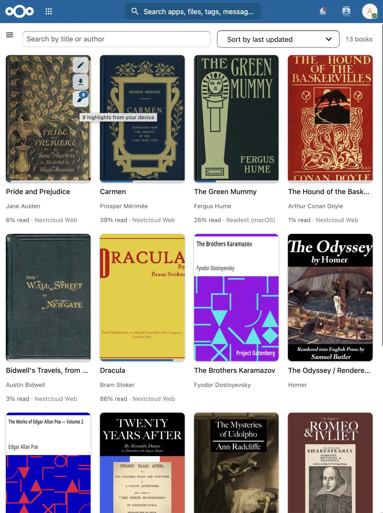
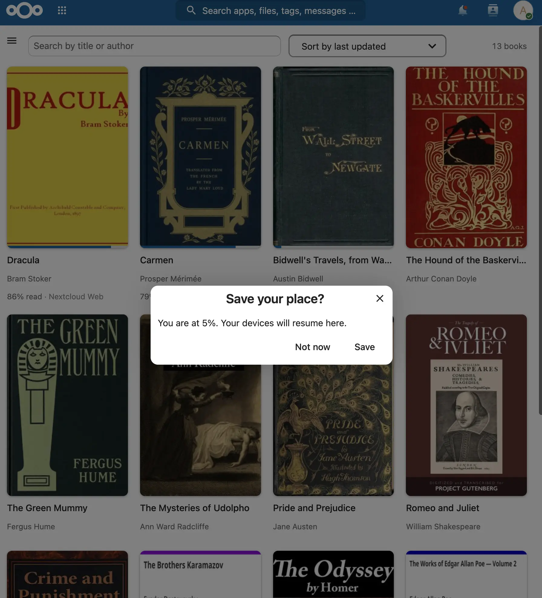
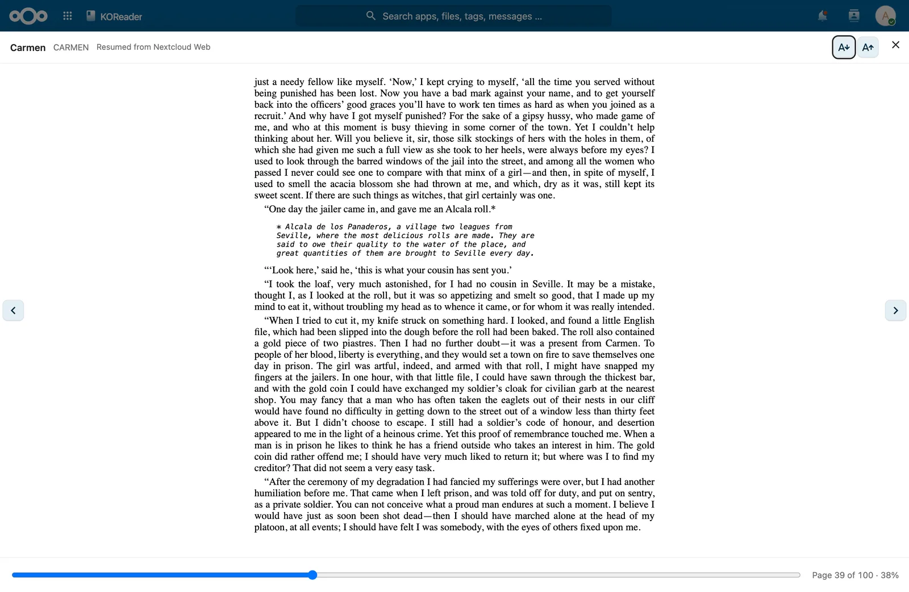
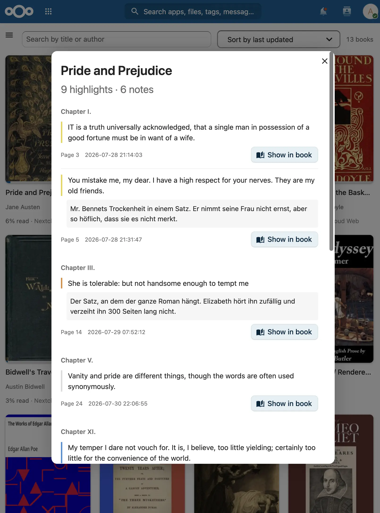
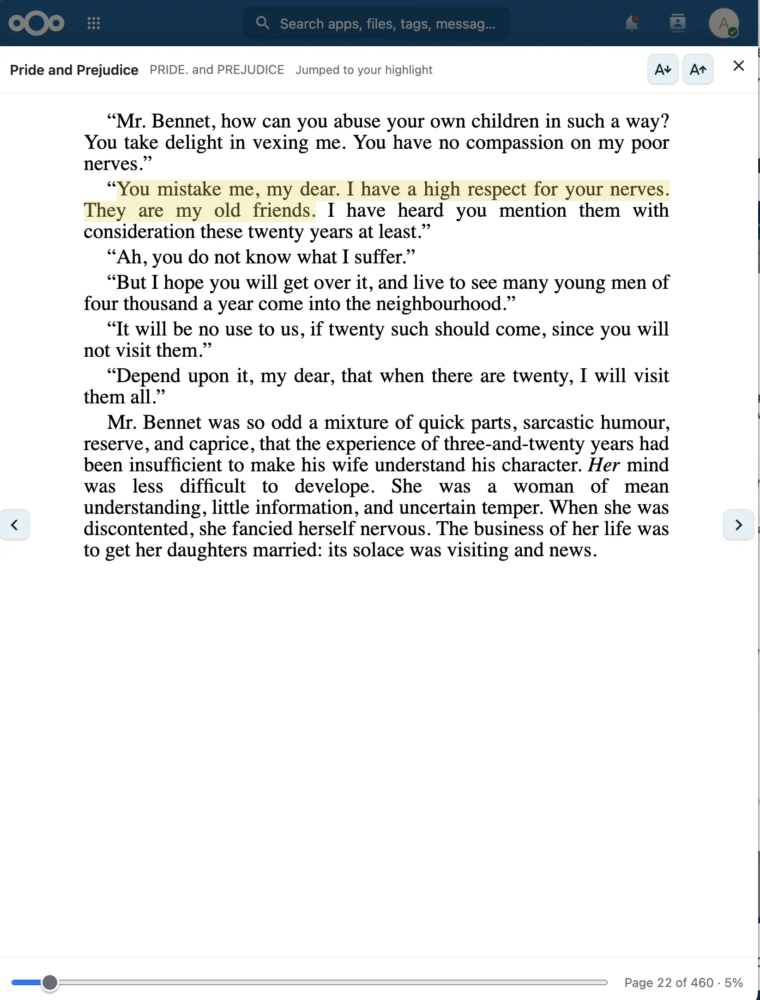
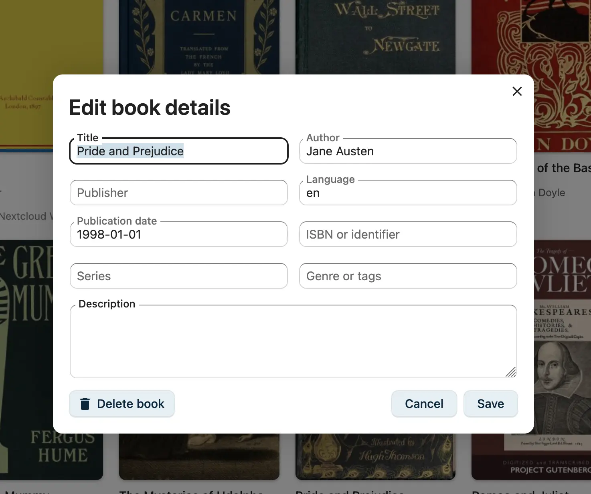

# KOReader Companion

An OPDS catalogue, a KOReader sync server and an EPUB reader for books stored in a Nextcloud folder.
Highlights made on a KOReader device can be listed and shown in the reader.

## Personal Development Project

**Important**: This app is developed for my personal use. While I'm happy to share my work with the community, please note:

- **No guarantees**: The app is provided as-is without warranty
- **Limited support**: I may not be able to provide extensive support or handle feature requests
- **Personal focus**: Development priorities are based on my own needs
- kesselborn fork: **all AI generated commits, not (yet) manually reviewed, don't use on public instances**

Feel free to use, fork, or contribute, but please understand the limitations.

## Features

The books stay ordinary files in an ordinary Nextcloud folder.

### Catalogue

<a href="docs/img/library-with-highlight-badge.webp"></a>

- OPDS 1.2 feed over a folder of your choice, readable by any OPDS client
- Browse by author, series, genre, format or language; search
- Authentication goes through Nextcloud's own login, so app passwords, LDAP and two-factor work
- EPUB, PDF, CBZ, CBR
- Web UI with search, sorting, and covers showing progress and the device that reported it

### Reading progress

<a href="docs/img/save-reading-position.webp"></a>

- Implements KOReader's `kosync` protocol; the device's _Progress sync_ screen works unmodified
- Positions are stored as KOReader position pointers rather than percentages, so a device resumes
  at the same word
- Uses a separate sync password, because the protocol sends an MD5 of it in a header

### Reader

<a href="docs/img/reader-resumes-device-position.webp"></a>

- EPUB only, in the browser, no download
- Opens at the position last synced from a device and names that device
- Single page, page numbers, adjustable font size, keyboard paging
- On closing, asks whether to save the new position; it is not written unless you say so
- Book content runs in a sandboxed frame without script permission

### Highlights and notes

<a href="docs/img/highlights-list.webp"></a>

- Reads the annotation files `AnnotationSync.koplugin` uploads over WebDAV — this needs a plugin
  installed on the device, see [step 3](#3-highlights-and-notes)
- A count on the cover opens a per-book list, grouped by chapter, with the note, page and timestamp

<a href="docs/img/reader-with-highlights.webp"></a>

- _Show in book_ opens the reader at that passage; the chapter's highlights are drawn in the colour
  used on the device
- Placement uses the device's own position data, not a text search, so repeated phrases are not
  marked in the wrong place
- Bookmarks are listed but not drawn — a bookmark is a point, not a range

### Library management

<a href="docs/img/edit-book-details.webp"></a>

- Upload from the browser, edit metadata, batch-rename files to a consistent pattern
- EPUB metadata is read from the file by a background job
- PDF metadata comes from the filename, Calibre layouts included; PDFs get a placeholder cover
- No external services, no telemetry, no outbound calls

## Requirements

- Nextcloud 34
- PHP 8.2+
- **Working background jobs** — `occ background:cron` is recommended. Metadata extraction runs as a
  background job, so without them books stay listed under their filename. (There is an _Extract
  metadata now_ button in the library for when you do not want to wait.)

## Installing it in Nextcloud

There is no app store release. Build the tarball and unpack it into your instance:

```bash
make release        # -> build/artifacts/appstore/koreader_companion.tar.gz
```

Then on the server:

```bash
tar -xzf koreader_companion.tar.gz -C /path/to/nextcloud/custom_apps/ # or the apps folder if custom_apps does not work
chown -R www-data:www-data /path/to/nextcloud/custom_apps/koreader_companion

sudo -u www-data php occ app:enable koreader_companion   # first install only
sudo -u www-data php occ upgrade                         # after every version bump
```

Finally, open the app and set two things: the folder holding your books, and a **KOReader sync
password** (at least 8 characters — this is not your Nextcloud password).

> **After a version bump, `occ upgrade` is not optional** — until it runs, the instance answers 503
> to everything. Then reload the browser with a hard refresh: Nextcloud caches the frontend by app
> version.

> **Copy the tarball, not an extracted folder.** macOS stores extended attributes in `._*` sidecar
> files, and copying an unpacked tree from a Mac creates them on the far side. Nextcloud reflects
> over every PHP file it finds, so one stray `._SettingsController.php` takes the whole app down
> with a baffling error. If it happens:
> `find /path/to/custom_apps/koreader_companion -name '._*' -delete`.

## Setting up KOReader

Three things, configured in three places on the device, and independent of each other. All three
want your Nextcloud user name and an **app password** (_Settings → Security → Devices & sessions_).

Replace `https://cloud.example.com` with your own host.

### 1. The library

_Main menu → OPDS catalog → add a catalogue_

| Field               | Value                                                    |
| ------------------- | -------------------------------------------------------- |
| Catalog name        | anything, e.g. `Nextcloud`                               |
| Catalog URL         | `https://cloud.example.com/apps/koreader_companion/opds` |
| Username / Password | your user name and an app password                       |

### 2. Reading progress

_Main menu → Progress sync → Custom sync server_

| Field              | Value                                                    |
| ------------------ | -------------------------------------------------------- |
| Custom sync server | `https://cloud.example.com/apps/koreader_companion/sync` |
| Username           | your Nextcloud user name                                 |
| Password           | the **sync password** you set in the app                 |

Then choose **Login** — not _Register_. The account already exists; it is your Nextcloud one, so the
server refuses registration on purpose. Turn on _Sync every N pages_ to have it happen by itself.

### 3. Highlights and notes

Stock KOReader cannot send annotations anywhere — its sync protocol has no field for them, and its
exporters are one-way and drop the positions. (_Send document metadata_ does not help either: that
sends the filename, title and authors, nothing more.)

[AnnotationSync.koplugin](https://github.com/dani84bs/AnnotationSync.koplugin) uploads one file per
book to cloud storage, and WebDAV is one of its targets — so it writes straight into your Nextcloud.

1. Copy the `AnnotationSync.koplugin` folder into `koreader/plugins/` on the device, keeping that
   exact name. Restart KOReader and enable it from the plugins menu.
2. _Tools → Annotation Sync → Settings → Cloud settings_, add a **WebDAV** server:

   | Field               | Value                                                        |
   | ------------------- | ------------------------------------------------------------ |
   | Address             | `https://cloud.example.com/remote.php/dav/files/<username>/` |
   | Folder              | your library folder, e.g. `/eBooks/`                         |
   | Username / Password | your user name and an app password                           |

3. Open a book, highlight something, then _Tools → Annotation Sync → Manual Sync_.

Worth knowing before you go looking for a fault:

- **KOReader's cloud browser shows the folder as empty.** It only lists files it can open, so the
  uploaded `.json` files are invisible to it. That is expected.
- **Leave AnnotationSync's own progress sync off.** Progress is step 2's job, and two sources for
  one position is how devices start disagreeing about where you are.
- Nothing to configure on the Nextcloud side — the app reads the library folder it already knows.
  If you would rather keep the files out of sight, a `.koreader-annotations/` subfolder inside the
  library works too.
- Bookmarks are listed but not drawn in the reader: a bookmark is a point, not a range.
- Highlights from a KOReader older than 2024 may not resolve, because the engine changed how it
  counts chapters. Those are skipped rather than placed at a guess.

## More

- [Development](docs/development.md) — local Docker stack, tests, translations, releases
- [Security notes](docs/security-audit.html) — what was reviewed before running this on a public instance
- [How KOReader stores annotations](docs/koreader-sidecar.md) — the file format, and why this works

## License

AGPL-3.0-or-later
